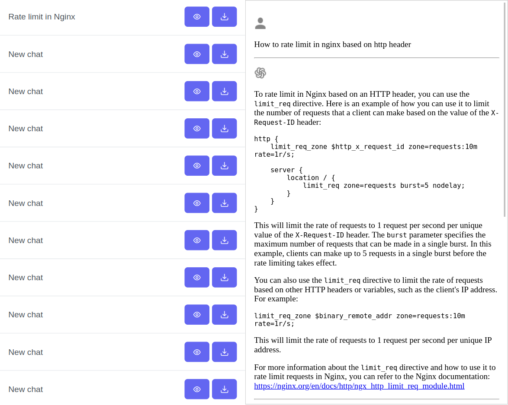

# Backup your ChatGPT conversations

A single client side script to backup your entire conversation history on [chat.openai.com](https://chat.openai.com). The output is a single JSON file of your history.

## You can now preview your backups by opening `index.html` locally.

1. Clone the repo: `git clone https://github.com/abacaj/chatgpt-backup.git`
2. Open `index.html` in your browser
3. Load the file from the top left



## How to use

1. Visit https://chat.openai.com
2. Make sure you are logged in
3. Open chrome console or firefox console (F12 on keyboard)
4. Click on "Console" tab
5. Copy the entire script content found in file backup.js and paste into the console input field at the bottom
6. Press enter, script starts and will log progress to console
   
7. If it fails at any point you can check the console logs to see the offset it failed at
8. You can run from any offset by adjusting the script offsets found at the bottom of the script:

```js
const START_OFFSET = 0;
const STOP_OFFSET = -1;
```

## How it works

This uses the same frontend API that is used by your client browser.

## Benefits

Some of the key benefits:

- Nothing to download or install
- Tested on chrome, firefox
- Fully client side, single script, copy paste to run
- Respects rate limits
- Fails early
- Adjust offsets if you have many conversations, ex. start at 0 to 500, then run 500 to 1000
- **Fully auditable code in the backup.js file, no third parties**

## Use cases

- Backup your conversation history offline
- The model output from the current OAI terms state that they belong to you
- Useful if you need to look back when the service is down
- Intended as a read-only backup (the ids aren't stored)

## Notes

- Tested with 700+ conversations
- Current rate is 60 conversations/minute
- Roughly 10 minutes for 600 conversations
- Roughly 1 hour for 6000 conversations
- This is to respect the OAI API rate limits
- Keep your browser tab open, you don't need it to be focused for this to finish
- Chrome **may** prompt you to download the file once it's completed
- Tested on firefox, requires you to type `allow pasting` before you can paste the script

## Contributors

- [@FredySandoval](https://github.com/FredySandoval)
